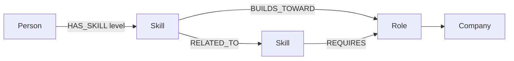

# SkillPath

SkillPath is a small career-transition explorer backed by CognoDB. It answers a human question: “Given what I can already do, what role is a credible next move, and which skills bridge the gap?”

## Why a graph database?

The useful answer is not a row lookup. It is a path through connected evidence: a person has a skill, that skill relates to another skill, and the second skill builds toward a role. The model can rank several paths and explain the bridge skills in one traversal. In a relational schema this needs several joins, a join table for every relationship type, and application code to assemble and rank variable-length paths. Graph relationships also let us add companies, projects, mentors, or endorsements without redesigning a central user table.

## Model



Nodes use `Person`, `Skill`, `Role`, and `Company` labels. The included seed uses realistic skill levels for Taylor Stone, three roles, three companies, and typed relationships with properties such as `HAS_SKILL.level`, `Skill.level`, `Role.company`, and `Role.salary`.

## Main Cypher queries

The source lives in `server/queries.ts` and every value is passed as a Neo4j driver parameter. The path finder uses a variable-length multi-hop traversal:

```cypher
MATCH (person:Person {id: $person})
MATCH p=(person)-[:HAS_SKILL]->(skill:Skill)-[:BUILDS_TOWARD|REQUIRES*1..2]->(role:Role {name: $role})
RETURN role, p, length(p)
ORDER BY length(p)
```

The `connections` query also traverses a skill neighborhood and is available at `/api/connections`, which is awkward to express with fixed relational joins when path depth changes.

## Run locally

1. Create a free C0 instance at [CognoDB Cloud](https://console.cognodb.com/signup). Copy the `bolt+s://...databases.cognodb.cloud` URI and password shown once.
2. Copy `.env.example` to `.env` and fill in `COGNODB_URI`, `COGNODB_USER`, and `COGNODB_PASSWORD`. `.env` is ignored and no credentials are committed.
3. Install and run the seed: `npm install`, then `npm run seed`.
4. Start both services with `npm run dev:full`. Fastify runs the graph API on `http://localhost:3001` and Next.js runs the UI, usually at `http://localhost:3000`.

Without credentials, SkillPath intentionally starts in a demo graph mode so the UI remains explorable. With credentials, the API runs the same queries against CognoDB and falls back gracefully if the instance is unreachable. The health check is available at `/api/health`.

## Structure

`app/` contains the Next.js interface and responsive visual system. `server/fastify.ts` owns configuration, error handling, and HTTP routes. `server/queries.ts` keeps Cypher reviewable and separate from transport. `server/seed.ts` creates constraints and realistic connected data. Next.js rewrites `/api/*` to Fastify during development.

## Screenshots and demo

The first screen is the path finder: enter a destination, inspect current skill signal, and compare ranked graph paths. The UI includes demo data, loading feedback, an empty state, and a database status indicator. Record a short walkthrough of this flow after seeding the instance for the submission video.
